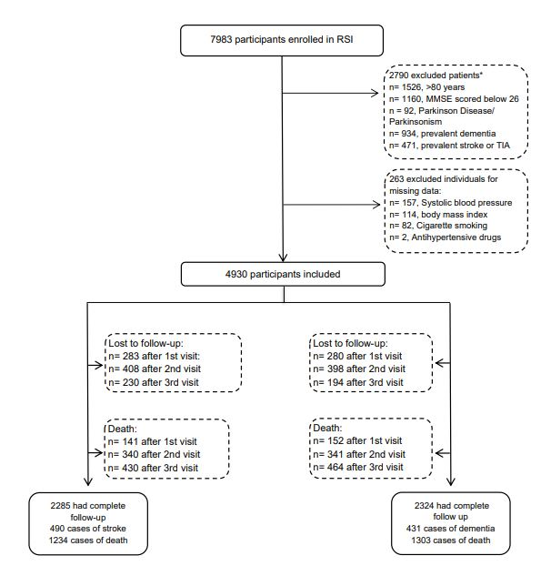

# Hypothetical blood-pressure-lowering interventions and risk of stroke and dementia {#chapter3}

\small
\noindent
_This chapter has been published as_:

Rojas-Saunero, L.P., Hilal, S., Murray, E.J. et al. Hypothetical blood-pressure-lowering interventions and risk of stroke and dementia. _Eur J Epidemiol_.2021; 36: 69–79. <https://doi.org/10.1007/s10654-020-00694-5>
\newpage
\normalsize


\chaptermark{Systolic blood pressure, stroke and dementia}

\newpage

## Abstract

**Objective:** To estimate the effects of hypothetical interventions on systolic blood pressure (SBP) and smoking on risk of stroke and dementia using data from 15 years of follow-up in the Rotterdam Study.

**Methods:** We used data from 4930 individuals, aged 55-80 years, with no prior history of stroke, dementia or cognitive impairment, followed for 15 years within the Rotterdam Study, a population-based cohort. We defined the following sustained interventions on SBP: (1) maintaining SBP below 120 mmHg, (2) maintaining SBP below 140 mmHg, (3) reducing SBP by 10% if above 140 mmHg, (4) reducing SBP by 20% if above 140 mmHg, and a combined intervention of quitting smoking with each of these SBP-lowering strategies. We considered incident stroke and incident dementia diagnoses as outcomes. We applied the parametric g-formula to adjust for baseline and time-varying confounding.

**Results:** The observed 15-year risk for stroke was 10.7%. Compared to no specified intervention (i.e., the “natural course”), all interventions that involved reducing SBP were associated with a stroke risk reduction of about 10% (e.g., reducing SBP by 20% if above 140mmHg risk ratio: 0.89; 95% CI: 0.76, 1). Jointly intervening on SBP and smoking status further decreased the risk of stroke (e.g., risk ratio: 0.83; 95% CI: 0.71, 0.94). None of the specified interventions were associated with a substantive change in dementia risk.

**Conclusions:** Our study suggests that a joint intervention on SBP and smoking cessation during later life may reduce stroke risk, while the potential for reducing dementia risk were not observed. 

**Keywords:** hypertension, dementia, stroke, target trial, g-formula


\newpage

## Introduction

The increase in life expectancy over the past decades has profound implications on the occurrence of diseases. As a result of the rapid demographic aging, the burden from common age-related diseases such as stroke and dementia are expected to rise dramatically[@larson2008]. As such, effective strategies to prevent or delay the onset of such diseases are in dire need. Targeting generally healthy individuals for age-related chronic diseases has the potential to have the greatest overall impact on population health[@bauer2014]. 


High blood pressure is a well-known modifiable risk factor for stroke[@johnson2019] and it has been proposed likewise for dementia[@lancet2020], although the specific biological mechanisms are heterogenous and less clear, such as the effect of chronic covert vascular damage (ischemia, microhemorrhage or atrophy)[@hughes2020]. Randomized clinical trials have reported that treatment of hypertension reduces the risk of first-ever stroke by 35–40% among elderly patients with systolic hypertension[@ace_inhibitors2000; @chobanian2003]. Some observational studies have assessed the association between lifestyle factors (i.e. unhealthy diet, smoking, drinking and physical inactivity) and stroke risk and have reported that 35-55% of stroke events were attributed to lifestyle factors[@braillon2015; @zhang2012; @prince1996]. Unlike for stroke, the evidence from trials and observational studies supporting the effects of lowering blood pressure on dementia risk is limited. Overall such trials have not had dementia as the primary outcome, were focused on highly selected patient groups and had short follow-up time (e.g., two to four years of follow-up)[@ace_inhibitors2000; @prince1996; @forette2002; @progress2003; @lithell2003; @diener2008; @anderson2011; @williamson2019; @ding2020]. In contrast, prior observational studies assessing the effect of systolic blood pressure or antihypertension medication were conducted in population-based cohorts with longer follow-up[@ding2020; @liang2018]. However, in both settings, most studies were not conducted to estimate the effect of a sustained treatment strategy with appropriate account for time-varying confounding and attention to competing risk of death. 


As a several-years-long randomized trial in the general population has not been conducted (and is likely unfeasible), decisions today regarding dynamic interventions on blood pressure and other lifestyle changes (e.g., quitting smoking) can be empirically informed using observational data to emulate a “target trial”[@zhang2018; @taubman2009; @jain2016; @danaei2018; @garcia_aymerich2014]. Target trial emulation requires clear specification of the trial protocol elements and, when assessing interventions sustained over time, analytic methods known as “g-methods” are required to appropriately account for time-dependent confounding[@whatif2020]. Previous studies have shown how results from observational studies can closely align with results from randomized controlled trials when the target trial framework is implemented[@lodi2019; @hernan2008]. In this study, we emulate a target trial to estimate the sustained effects of several hypothetical interventions on systolic blood pressure (SBP) control, including in combination with an intervention on smoking over follow-up, on the risk of first-ever stroke and dementia using data from 15 years of follow-up in the Rotterdam Study. 


## Methods


We begin by briefly describing the target trial specifications and then how we attempt to emulate the trial using data from the Rotterdam Study. A detailed comparison between the target trial and the emulation using observational data, is provided in the online resource, Table e-1.

### Target trial specification

Key protocol elements of a target trial include:


**_Eligibility criteria:_** Individuals 55-80 years old, with no prior history of stroke, transient ischemic attack, Parkinson´s Disease, Parkinsonism, dementia or cognitive impairment.


**_Treatment strategies:_** Eligible individuals are assigned to one of the following sustained strategies, to be followed for the duration of the study: (1) maintaining SBP below 120 mmHg, (2) maintaining SBP below 140 mmHg, (3) reducing SBP by 10% if above 140 mmHg, (4) reducing SBP by 20% if above 140 mmHg. The means for following these strategies are not pre-specified (i.e., SBP may be reduced via lifestyle or medication interventions); we return to this point in the discussion. Given the known health effects of smoking, we further considered the intervention of (5) quitting smoking, and also four joint interventions combining (5) with (1), (2), (3), and (4). We compare all these strategies to the “natural course”, which represents no pre-specified treatment strategy. Of note, strategies (1) and (2) align with recent studied strategies in a randomized trial[@williamson2019], while (3) and (4) perhaps are more achievable in practice.


**_Outcome recording:_** The two primary outcomes of interest were first stroke event and dementia diagnosis within 15 years of follow-up, as recorded by continuous linkage to medical records and periodic cognitive assessments. Because death is a competing event, we also considered composite outcomes with death as a secondary analysis. 


**_Start and end of follow-up:_** Each eligible individual is followed from when they meet our eligibility criteria described above. They are followed until first stroke event, dementia diagnosis, death, incomplete follow-up, or administrative end of follow-up after 15 years from baseline.

### Target trial emulation

**_Study design and public involvement:_**  To emulate the described target trial, we used data from The Rotterdam Study (RS), a population-based prospective cohort study among middle age and elderly persons living in the Ommoord district in the city of Rotterdam, the Netherlands. Participants living in the district were invited to participate in the cohort between 1990 and 1993. All participants underwent questionnaire administration, physical and clinical examinations, and blood sample collection at baseline (1990-1993) and at follow-up visits from 1993-1995, 1997-1999, 2002-2005[@ikram2017]. 


**_Eligibility criteria:_** Same as specified above. Prior history of stroke, transient ischemic attack, Parkinson´s Disease, Parkinsonism and dementia were assessed by using home interviews and by reviewing medical records, and cognitive impairment defined as a Mini Mental State Examination (MMSE) below 26 at first study visit. Thus, of the 7983 persons who participated at baseline, 5193 were considered eligible for this study based on the above-mentioned criteria. We further required complete information on SBP, BMI, smoking status and/or hypertensive medication at intake, giving a final sample size of 4930 participants (figure 1). Participants with missing covariates, which represent a 5% of the eligible sample, were, on average, three years older than those included, had a higher frequency of primary education and had a higher prevalence of heart disease and diabetes at baseline (Online resource, Table e-2).


**_Treatment strategies:_** Same as specified above. SBP was measured in two readings using a random-zero sphygmomanometer in a sitting position, and the mean of both measurements was calculated during each follow-up visit. Smoking habit for cigarettes was collected using a detailed questionnaire and was categorized as never, current and former.


**_Outcome recordings:_** Incident stroke was collected by continuously monitoring through computerized linkage of the study database and digitized medical records from general practitioners and the Regional Institute for Outpatient Mental Health Care. For participants who moved outside the study district or lived in nursing homes, medical records were regularly checked by contacting their treating physicians. Research physicians reviewed all potential strokes using hospital discharge letters and information from general practitioners and nursing home physicians. An experienced vascular neurologist verified the stroke diagnosis[@wieberdink2012; @akoudad2015]. In accordance with World Health Organization criteria, stroke was defined as a syndrome of rapidly emerging clinical signs of focal or global disturbance of cerebral function. Symptoms should last ≥24 hours or cause death, with no apparent cause other than of vascular origin.


Dementia diagnosis was collected by screening during the cohort visits, using MMSE and the Geriatric Mental Schedule (GMS) organic level. Screen-positives (MMSE<26 or GMS organic level>0) subsequently underwent an examination and informant interview with the Cambridge Examination for Mental Disorders in the Elderly. A consensus panel led by a consultant neurologist established the final diagnosis according to standard criteria for dementia (DSM-III-R). Additionally, participants were continuously followed up for the occurrence of dementia through automated linkage of general practitioners’ medical records with the study database[@debruijn2015; @ott1999] as with stroke.


Vital status was obtained on a weekly basis via municipal population registries and through general practitioners’ and hospitals’ databases. All-cause mortality was defined as participants who died from any cause during the total follow-up period. 


**Start and end of follow-up:_** We defined baseline as the date of recruitment in the Rotterdam Study for individuals for whom the above-described eligibility criteria were met on that date. Study participants were followed up from study baseline until stroke, dementia, death, censoring due to loss to follow-up, or 15 years after baseline, whichever occurred first. We defined loss to follow-up for stroke as follows: Participants who skipped a visit or were lost to follow-up were censored at the last year in which the next visit could have taken place. Of the included participants who did not develop the main outcome or died during follow-up, 283 (9%) were lost after the first visit, 408 (13%) after the second visit, 230 (7%) after the third visit, and 2285 (71%) were censored after the fourth round. For dementia analysis, we followed participants until dementia diagnosis, death, or censored as previously defined. Of the 4930 included participants, 280 (9%) were lost after the first visit, 398 (12%) after the second visit, 194 (6%) after the third visit, and 2324 (73%) were censored after the fourth round (figure 1).


<div class="figure">

<p class="caption">(\#fig:03_fig1)(ref:Flowchart)</p>
</div>


(ref:Flowchart) __Flowchart__. After a baseline block without stimulation, participants performed the attentional blink task during 20 minutes of anodal.

### Statistical Analysis:

To estimate the risk of stroke and dementia under the described hypothetical interventions, we used the parametric g-formula, an extension of standardization to time-varying exposures and confounders. Under the assumptions of no unmeasured confounding and no model misspecification, this method provides an estimate of the risk of outcomes under full adherence to different hypothetical sustained interventions[@taubman2009; @garcia_aymerich2014; @danaei_epid2013; @vangenlonne2018; @dickerman2019].

The simplified steps for the parametric g-formula, using stroke as the outcome are described as follows:

1. Fit parametric regression models for each of the time-varying covariates, as a function of baseline covariates and covariates history among participants followed up to time _k_.


2. Fit parametric regression models for stroke and death, as a function of baseline covariates and covariates history among participants followed up to the time _k_, using pooled logistic regression to approximate time-to-failure risk.


3. Use a Monte Carlo simulation to generate life histories for a pseudo-population of 10000 simulated individuals.

  - Baseline covariates are randomly sampled with replacement from the original population.

  - The values of time-varying covariates are drawn from the parametric distribution in Step 1.

  - The value of the covariates that will be “intervened” on is set according to the defined strategy (skip this step for the “natural course strategy”).

  - The predicted risk of dementia and death is calculated for each individual in the pseudo-population.


4. Calculate the mean predicted risk of stroke and death at 15 years in the pseudo-population.


5. Calculate the risk difference between each strategy and the natural course.


6. Repeat previous steps in 500 bootstraps samples to obtain the 95% confidence interval (CI).


7. For each strategy repeat step 3 to 6.

The same steps were performed with dementia as an outcome.  Our primary analyses consisted of models with baseline confounders which included: age with a quadratic term, sex, APOE-ε4 carrier, history of type-II diabetes mellitus, history of heart disease, education level, baseline SBP with a cubic term. Additionally, we also included time-varying covariates: the visit process, SBP, cholesterol, BMI, alcohol intake, smoking status, hypertensive medications, incident heart disease, incident diabetes, incident cancer, incident transient ischemic attack and incident Parkinson Disease or Parkinsonism. Details on measurements of these variables are available in the online supplementary material (Measurements). When stroke was the principal outcome, we included dementia as a time-varying confounder, and vice versa. All covariates that were measured during the visit process were modeled under the condition of having attended the visit (Online resource, Table e-3). To probe for potential model misspecification, we estimated the difference between the observed mean value and the predicted mean value for each covariate (Online resource, Figure e-1, Figure e-2). We also conducted a sensitivity analysis of reordering the time-varying covariates to probe potential model misspecification.


The results are presented as the average causal effect under each hypothetical intervention at 15 years of follow-up compared to the natural course as a risk ratio and risk difference. For each intervention, we further report the cumulative proportion of participants who would have had to have been intervened on during the follow-up, to adhere to the strategy. We additionally presented the standardized cumulative incidence curves, comparing the risk over time under the natural course and the joint treatment strategy.


**_Competing risk analysis:_** During follow-up, individuals can die before developing stroke and dementia, and interventions may affect the risk of death in our main analysis. For this reason, we estimate the risk of stroke and dementia taking into account that individuals can also progress to death. This means that the effect on our main outcome is through all pathways between the interventions and the outcome, including those possibly mediated by this competing event. We additionally run the primary analysis considering death as a censoring event, however the interpretation in this setting emulates a counterfactual world in which death could be entirely prevented, which would not be realistic and relies on additional stronger no-unmeasured-confounding assumptions[@young2020]. Finally, we performed analysis considering the effect of each intervention in the composite outcome with death (i.e., stroke and death, dementia and death).


**_Subgroup analysis:_** We repeated our primary analyses within the following subgroups:  age 55 to 65 years; age between 66 and 80 years; women, men; without hypertensive medication at baseline; and free of heart disease at baseline.


All g-formula analyses were conducted using SAS 9.4 software and the GFORMULA macro that is publicly available at http://www.hsph.harvard.edu/causal/software. The SAS code for the GFORMULA macro call for our primary analysis is available on the following repository
https://github.com/palolili23/ht_trial_gformula. 

## Results

Table 1 shows the baseline characteristics of the study participants. The mean age of the participants was 66 years and 57% were women. The mean SBP at baseline was 137 mmHg, and 24% were current cigarette smokers.

**_Stroke risk:_** During the 15 years of follow-up, there were 490 cases of incident stroke and 1234 deaths. The observed 15 years risk for stroke was 10.3% and under the simulated natural course was 10.3% (95%CI: 9.3, 11.5). The risk of stroke under the different hypothetical treatment strategies are presented in Table 2. Overall, all interventions that lowered SBP under a threshold reduced the risk of stroke by approximately 10% compared to the natural course during the study period. Although all interventions on SBP had a similar association with risk of stroke, the most intensive treatment strategy studied (“maintaining SBP below 120 mmHg”) required intervening in 98% of the population at some point in follow-up, which involved 15% more people compared to all other strategies. By contrast, smoking cessation was associated with a reduction in stroke risk by 7% (RR 95%CI: 0.89, 0.97) compared to the natural course, and required an intervention on only 26% of the population. All joint interventions showed a larger reduction in the risk of stroke. For example, lowering SBP by 20% if above 140 mmHg and quitting smoking was associated with a 17% (RR 95% CI: 0.71, 0.94) reduction in the risk of stroke over the study period compared to the natural course as observed in Figure 2A.

**_Dementia risk:_** During the 15 years of follow-up, there were 431 cases of dementia and 1303 deaths. The observed 15-year risk for dementia was 8.9% and under the simulated natural course was 9.2% (95% CI: 8.2, 10.3%). The risk of dementia under the different hypothetical interventions are shown in Table 3. Overall, none of the treatment strategies involving SBP were associated with substantial changes in risk of dementia. For example, the treatment strategy “maintaining SBP below 120 mmHg” was associated with a 6% (RR 95% CI: 0.90, 1.24) increase in dementia risk compared to the natural course. This pattern was likewise seen for the treatment strategy of smoking cessation and joint treatment strategies involving lowering SBP and smoking cessation. For example, lowering SBP by 20% if above 140 mmHg and quit smoking was associated with an increment in dementia risk of 5% (RR 95% CI: 0.92, 1.20) as observed in Figure 3A.


Alternative analyses for competing event: Given that death was modeled as a competing event for both outcomes (stroke and dementia), we present the effect of the intervention “lowering 20% of SBP if above 140 mmHg and quit smoking” on the risk of death in Figure 2B and Figure 3B respectively. Treating death as a censoring event and as part of a composite outcome did not meaningfully change the results, as presented in the online resource, Table e-4, e-5, e-11, e-12.


<!-- ```{r 03_fig2, fig.cap='(ref:Figure 2)', results='show'} -->
<!-- knitr::include_graphics("figs/03_fig2.jpg", auto_pdf = TRUE) -->
<!-- ``` -->

<!-- (ref:Figure 2) _Figure 2._ Risk of stroke under the natural course and under the joint intervention: Reduce SBP by 20% if above 140 mmHg and quit smoking at 15 years of follow-up. -->

<!-- ```{r 03_fig3, fig.cap='(ref:Figure 3)', results='show'} -->
<!-- knitr::include_graphics("figs/03_fig3.jpg", auto_pdf = TRUE) -->
<!-- ``` -->
<!-- (ref: Figure 3) _Figure 3._ Risk of dementia under the natural course and under the joint intervention: Reduce SBP by 20% if above 140 mmHg and quit smoking at 15 years of follow-up. -->


**_Subgroup analyses:_** Table 4 provides estimates for the treatment strategy “lowering 20% of SBP if above 140 mmHg and quit smoking” on the risk of stroke and dementia by subgroups (age, sex, without hypertension medication at baseline, free of heart disease at baseline) compared to the natural course. Estimates were relatively consistent for stroke risk across subgroups, with the exception of individuals with age below 65 years among whom there appeared to be a much stronger association (RR: 0.75, 95% CI: 0.56,  0.98).For dementia risk, subgroup analyses present similar findings. Additional treatment strategies are presented in the online resource, Table e-6 to e- 11, e-14 to e-19.

## Discussion


Our study suggests that intervening on blood pressure could reduce stroke risk by approximately 10% over 15 years of follow-up in a population-based setting, and that combining such interventions with smoking cessation could result in an overall reduction of 18%. In contrast, our study is consistent with these same interventions having null or opposite effects on risk of dementia, taking into account that these estimates could be affected by how the interventions may decrease the risk of death. 


Our results on stroke risk are comparable in direction but not quite in magnitude of prior studies’ effect estimates. A previous meta-analysis of randomized trials has shown that a 10 mmHg reduction in blood pressure decreases the risk of stroke by 27%, though this effect was observed in a high-risk population of individuals with cardiovascular diseases[@ettehad2016]. The most comparable observational study to ours was one emulating hypothetical treatment strategies to reduce SBP in middle-aged (i.e., baseline mean age 46.1 years or about 20 years younger that our study) healthy individuals from Norway, also using the g-formula. This study showed that a 23 mmHg average reduction in blood pressure of 120 mmHg and above resulted in a 45% reduction in stroke risk over a 15 year period[@vangenlonne2018]. The difference in the risk estimates might be due to differences in the average age of the study populations. Of note, no differences in proportional risk reductions were reported in trials involving persons with systolic blood pressure <130 mmHg and those at high risk (≥160 mmHg)[@ettehad2016]. Our study also adds to these prior studies by considering a joint intervention with smoking cessation, although our combined strategies appears to reduce stroke risk by a much lower amount (18%) than those reported previously in observational studies (35-55%)[@chiuve2008; @braillon2015; @zhang2012].


To compare the results from our hypothetical intervention on blood pressure (dropping below 120 or 140 mmHg over time) in dementia risk with previous research, we must consider the differences in the eligibility criteria, treatment strategies and analytical choices. Our target trial by design follows similar treatment strategies such as the  Systolic Blood Pressure Intervention Trial (SPRINT) MIND trial, however this trial considered eligible individuals as those who had risk of cardiovascular disease[@williamson2019], which represents a small subgroup of our population-based cohort. (Specifically, at most 290 individuals in the Rotterdam Study would meet criteria at baseline, based on our assessments of SBP, presence of cardiovascular disease other than stroke and history of diabetes.)  Similarly, since previous trials were primarily designed to assess the effect of antihypertensive medication on the risk of stroke and did not have dementia as their primary outcome, they were tailored to a specific subgroup of individuals who required treatment. Eligibility criteria in other trials included having had a history of stroke, being above 80 years old and having a SBP above 160 mmHg[@ace_inhibitors2000; @prince1996; @forette2002; @progress2003; @lithell2003; @diener2008; @anderson2011; @williamson2019; @bosch2019].  Furthermore, assessing the comparability of our findings with prior observational studies requires caution. A recent meta-analysis by Ding et al. have studied the effect of taking any antihypertensive medication and specific antihypertensive medications and the risk of dementia stratified by SBP including five large population-based cohort[@ding2020]. However, they assess the effect being on treatment at baseline and only include baseline covariates for adjustment. Similarly, Want et al. stratify individuals by longitudinal blood pressure patterns (mid-life and late-life normotension/hypertension), but covariates are measured during two of the six visits[@walker2019]. In contrast, we assessed the sustained effect of lowering SBP over time given time-updated covariates. Last, we consider that our findings reflect the relevance of the competing event of death by other causes, and how estimates are likely affected by the effect of interventions on the risk of death, and give a more comprehensive view of the implications of these results. This will be especially important when we stratify by characteristics that have a different survival distribution, as we observe in the different direction of the effects among women vs. men[@beam2018]. Reconsidering these points as part of how we frame research question and analytical decisions when using observational data, will have a direct impact on results interpretation and clinical translation. 


By leveraging a rich dataset in a population-based observational study, high-quality and frequent assessments of outcomes and key covariates, and the use of the parametric g-formula to account for the complex confounding structure assumed, we emulated a “target trial” that may be of key public health interest but would not be easily conducted as a randomized trial. However, like any observational data analysis, several assumptions need to be carefully weighed. The possibility of unmeasured confounding remains, and in particular we were unable to adjust for covariates such as types of antihypertension medications, LDL (as separate from total cholesterol), glucose and frailty in our analysis. Likewise, we used MMSE as a screening tool and excluded individuals with Parkinson disease or parkinsonism symptoms at baseline, but it is possible that persons with subclinical cognitive impairment might be included in our analysis at baseline or during follow-up[@joe2019]. Self-reported smoking status is also subject to measurement error, although we did assess the consistency of our measurements over time. In addition, the parametric g-formula relies on several strong modeling assumptions. As reported in the online resource Figure e-1, Figure e-2, we observed an agreement between the mean estimated values of each variable (outcomes and covariates) under the natural course with their observed values, which supports but does not prove these model specifications hold[@taubman2009]. Furthermore, we did not assess the effect of the hypothetical interventions in the specific clinical phenotypes of each disease, since numbers on the disaggregated clinical subtypes are small and is further complicated by each subtype being a competing event for each other. However, the effect of lowering blood pressure may effect in the risk of each clinical subtype in different magnitude and should be addressed in future studies. 


Finally, another key point to reflect upon in interpreting our specified treatment strategies is that we did not, in fact, specify how SBP would be lowered. This means our estimates are based on the consistency assumption that lowering SBP through any available means (e.g., dietary changes, medication use, other lifestyle changes) would have the same effect on stroke or dementia risk, or otherwise are at best interpretable as estimates for an effect of a weighted average of several SBP-lowering strategies with weights determined by the frequency that the particular strategies  occur in our specific population[@waterkills; @hernan2011]. Future studies that have more detailed assessments of these various SBP-lowering treatments are needed to disentangle treatment variation relevance and build upon this initial study. Furthermore, smoking cessation is one of several more specific behavioral interventions that could be assessed, as well as other metabolic factors described in current guidelines[@johnson2019; @lancet2020]. Implementing the target-trial framework and defining research questions to study more refined or further specified treatment strategies is a crucial next step. Doing so will require rich, longitudinal data on the specific interventions under study; the level of specificity in the research questions that can be studied is hampered in part by the data currently available. Thus, while there are certainly limitations in terms of ambiguity to the interventions studied in the current paper, they represent an improvement (in terms of clarity and for informing decision-making) over etiologic studies that address SBP’s effects with a simplified version of the complexity of real data, and a step toward the types of interventions we may consider in practice.


Given previous considerations, studying population-level interventions as done here is particularly suitable for public health research, in that we can better understand how particular recommendations may affect stroke or dementia risk at the population-level rather than as estimated in high-risk subpopulations. Importantly, while the possible effect of blood pressure control on dementia risk remains debated, our findings nonetheless align with the recent WHO Report’s recommendation that lowering blood pressure has substantial benefits (in terms of stroke risk and mortality, here) that may motivate blood pressure control regardless of its possible effects on dementia risk[@who_dementia2019].

## Figure legends
Figure 1. Flowchart
Figure 2. Risk of stroke under the natural course and under the joint intervention: Reduce SBP by 20% if above 140 mmHg and quit smoking at 15 years of follow-up
Figure 3. Risk of dementia under the natural course and under the joint intervention: Reduce SBP by 20% if above 140 mmHg and quit smoking at 15 years of follow-up 

## Supplementary information

### Table e-1.Target trial description

Emulation of a target trial of multiple and joint strategies to lower the risk of stroke among adults from 55 to 80 years old.


```{=html}
<style>html {
  font-family: -apple-system, BlinkMacSystemFont, 'Segoe UI', Roboto, Oxygen, Ubuntu, Cantarell, 'Helvetica Neue', 'Fira Sans', 'Droid Sans', Arial, sans-serif;
}

#sxrzssweea .gt_table {
  display: table;
  border-collapse: collapse;
  margin-left: auto;
  margin-right: auto;
  color: #333333;
  font-size: 16px;
  font-weight: normal;
  font-style: normal;
  background-color: #FFFFFF;
  width: auto;
  border-top-style: solid;
  border-top-width: 2px;
  border-top-color: #A8A8A8;
  border-right-style: none;
  border-right-width: 2px;
  border-right-color: #D3D3D3;
  border-bottom-style: solid;
  border-bottom-width: 2px;
  border-bottom-color: #A8A8A8;
  border-left-style: none;
  border-left-width: 2px;
  border-left-color: #D3D3D3;
}

#sxrzssweea .gt_heading {
  background-color: #FFFFFF;
  text-align: center;
  border-bottom-color: #FFFFFF;
  border-left-style: none;
  border-left-width: 1px;
  border-left-color: #D3D3D3;
  border-right-style: none;
  border-right-width: 1px;
  border-right-color: #D3D3D3;
}

#sxrzssweea .gt_title {
  color: #333333;
  font-size: 125%;
  font-weight: initial;
  padding-top: 4px;
  padding-bottom: 4px;
  border-bottom-color: #FFFFFF;
  border-bottom-width: 0;
}

#sxrzssweea .gt_subtitle {
  color: #333333;
  font-size: 85%;
  font-weight: initial;
  padding-top: 0;
  padding-bottom: 4px;
  border-top-color: #FFFFFF;
  border-top-width: 0;
}

#sxrzssweea .gt_bottom_border {
  border-bottom-style: solid;
  border-bottom-width: 2px;
  border-bottom-color: #D3D3D3;
}

#sxrzssweea .gt_col_headings {
  border-top-style: solid;
  border-top-width: 2px;
  border-top-color: #D3D3D3;
  border-bottom-style: solid;
  border-bottom-width: 2px;
  border-bottom-color: #D3D3D3;
  border-left-style: none;
  border-left-width: 1px;
  border-left-color: #D3D3D3;
  border-right-style: none;
  border-right-width: 1px;
  border-right-color: #D3D3D3;
}

#sxrzssweea .gt_col_heading {
  color: #333333;
  background-color: #FFFFFF;
  font-size: 100%;
  font-weight: normal;
  text-transform: inherit;
  border-left-style: none;
  border-left-width: 1px;
  border-left-color: #D3D3D3;
  border-right-style: none;
  border-right-width: 1px;
  border-right-color: #D3D3D3;
  vertical-align: bottom;
  padding-top: 5px;
  padding-bottom: 6px;
  padding-left: 5px;
  padding-right: 5px;
  overflow-x: hidden;
}

#sxrzssweea .gt_column_spanner_outer {
  color: #333333;
  background-color: #FFFFFF;
  font-size: 100%;
  font-weight: normal;
  text-transform: inherit;
  padding-top: 0;
  padding-bottom: 0;
  padding-left: 4px;
  padding-right: 4px;
}

#sxrzssweea .gt_column_spanner_outer:first-child {
  padding-left: 0;
}

#sxrzssweea .gt_column_spanner_outer:last-child {
  padding-right: 0;
}

#sxrzssweea .gt_column_spanner {
  border-bottom-style: solid;
  border-bottom-width: 2px;
  border-bottom-color: #D3D3D3;
  vertical-align: bottom;
  padding-top: 5px;
  padding-bottom: 6px;
  overflow-x: hidden;
  display: inline-block;
  width: 100%;
}

#sxrzssweea .gt_group_heading {
  padding: 8px;
  color: #333333;
  background-color: #FFFFFF;
  font-size: 100%;
  font-weight: initial;
  text-transform: inherit;
  border-top-style: solid;
  border-top-width: 2px;
  border-top-color: #D3D3D3;
  border-bottom-style: solid;
  border-bottom-width: 2px;
  border-bottom-color: #D3D3D3;
  border-left-style: none;
  border-left-width: 1px;
  border-left-color: #D3D3D3;
  border-right-style: none;
  border-right-width: 1px;
  border-right-color: #D3D3D3;
  vertical-align: middle;
}

#sxrzssweea .gt_empty_group_heading {
  padding: 0.5px;
  color: #333333;
  background-color: #FFFFFF;
  font-size: 100%;
  font-weight: initial;
  border-top-style: solid;
  border-top-width: 2px;
  border-top-color: #D3D3D3;
  border-bottom-style: solid;
  border-bottom-width: 2px;
  border-bottom-color: #D3D3D3;
  vertical-align: middle;
}

#sxrzssweea .gt_from_md > :first-child {
  margin-top: 0;
}

#sxrzssweea .gt_from_md > :last-child {
  margin-bottom: 0;
}

#sxrzssweea .gt_row {
  padding-top: 8px;
  padding-bottom: 8px;
  padding-left: 5px;
  padding-right: 5px;
  margin: 10px;
  border-top-style: solid;
  border-top-width: 1px;
  border-top-color: #D3D3D3;
  border-left-style: none;
  border-left-width: 1px;
  border-left-color: #D3D3D3;
  border-right-style: none;
  border-right-width: 1px;
  border-right-color: #D3D3D3;
  vertical-align: middle;
  overflow-x: hidden;
}

#sxrzssweea .gt_stub {
  color: #333333;
  background-color: #FFFFFF;
  font-size: 100%;
  font-weight: initial;
  text-transform: inherit;
  border-right-style: solid;
  border-right-width: 2px;
  border-right-color: #D3D3D3;
  padding-left: 12px;
}

#sxrzssweea .gt_summary_row {
  color: #333333;
  background-color: #FFFFFF;
  text-transform: inherit;
  padding-top: 8px;
  padding-bottom: 8px;
  padding-left: 5px;
  padding-right: 5px;
}

#sxrzssweea .gt_first_summary_row {
  padding-top: 8px;
  padding-bottom: 8px;
  padding-left: 5px;
  padding-right: 5px;
  border-top-style: solid;
  border-top-width: 2px;
  border-top-color: #D3D3D3;
}

#sxrzssweea .gt_grand_summary_row {
  color: #333333;
  background-color: #FFFFFF;
  text-transform: inherit;
  padding-top: 8px;
  padding-bottom: 8px;
  padding-left: 5px;
  padding-right: 5px;
}

#sxrzssweea .gt_first_grand_summary_row {
  padding-top: 8px;
  padding-bottom: 8px;
  padding-left: 5px;
  padding-right: 5px;
  border-top-style: double;
  border-top-width: 6px;
  border-top-color: #D3D3D3;
}

#sxrzssweea .gt_striped {
  background-color: rgba(128, 128, 128, 0.05);
}

#sxrzssweea .gt_table_body {
  border-top-style: solid;
  border-top-width: 2px;
  border-top-color: #D3D3D3;
  border-bottom-style: solid;
  border-bottom-width: 2px;
  border-bottom-color: #D3D3D3;
}

#sxrzssweea .gt_footnotes {
  color: #333333;
  background-color: #FFFFFF;
  border-bottom-style: none;
  border-bottom-width: 2px;
  border-bottom-color: #D3D3D3;
  border-left-style: none;
  border-left-width: 2px;
  border-left-color: #D3D3D3;
  border-right-style: none;
  border-right-width: 2px;
  border-right-color: #D3D3D3;
}

#sxrzssweea .gt_footnote {
  margin: 0px;
  font-size: 90%;
  padding: 4px;
}

#sxrzssweea .gt_sourcenotes {
  color: #333333;
  background-color: #FFFFFF;
  border-bottom-style: none;
  border-bottom-width: 2px;
  border-bottom-color: #D3D3D3;
  border-left-style: none;
  border-left-width: 2px;
  border-left-color: #D3D3D3;
  border-right-style: none;
  border-right-width: 2px;
  border-right-color: #D3D3D3;
}

#sxrzssweea .gt_sourcenote {
  font-size: 90%;
  padding: 4px;
}

#sxrzssweea .gt_left {
  text-align: left;
}

#sxrzssweea .gt_center {
  text-align: center;
}

#sxrzssweea .gt_right {
  text-align: right;
  font-variant-numeric: tabular-nums;
}

#sxrzssweea .gt_font_normal {
  font-weight: normal;
}

#sxrzssweea .gt_font_bold {
  font-weight: bold;
}

#sxrzssweea .gt_font_italic {
  font-style: italic;
}

#sxrzssweea .gt_super {
  font-size: 65%;
}

#sxrzssweea .gt_footnote_marks {
  font-style: italic;
  font-size: 65%;
}
</style>
<div id="sxrzssweea" style="overflow-x:auto;overflow-y:auto;width:auto;height:auto;"><table class="gt_table">
  
  <thead class="gt_col_headings">
    <tr>
      <th class="gt_col_heading gt_columns_bottom_border gt_left" rowspan="1" colspan="1">Section</th>
      <th class="gt_col_heading gt_columns_bottom_border gt_left" rowspan="1" colspan="1">Target.trial</th>
      <th class="gt_col_heading gt_columns_bottom_border gt_left" rowspan="1" colspan="1">Emulation using observation data</th>
    </tr>
  </thead>
  <tbody class="gt_table_body">
    <tr>
      <td class="gt_row gt_left">Aim</td>
      <td class="gt_row gt_left">To estimate the effect of joint interventions on 15-year risk of stroke among people at risk</td>
      <td class="gt_row gt_left">Same</td>
    </tr>
    <tr>
      <td class="gt_row gt_left">Eligibility criteria</td>
      <td class="gt_row gt_left">Individuals below 80 years old, with no prior history of stroke or transient ischemic attack, cognitive impairment, dementia diagnosis or Parkinson’s disease or Parkinsonism.</td>
      <td class="gt_row gt_left">Same  + MMSE above 26 at baseline.</td>
    </tr>
    <tr>
      <td class="gt_row gt_left">Treatment strategies</td>
      <td class="gt_row gt_left">1. Maintaining SBP below 120 mmHg</td>
      <td class="gt_row gt_left">Same</td>
    </tr>
    <tr>
      <td class="gt_row gt_left">NA</td>
      <td class="gt_row gt_left">2. Maintaining SBP below 140 mmHg</td>
      <td class="gt_row gt_left">NA</td>
    </tr>
    <tr>
      <td class="gt_row gt_left">NA</td>
      <td class="gt_row gt_left">3. Reducing SBP by 10% if above 140 mmHg</td>
      <td class="gt_row gt_left">NA</td>
    </tr>
    <tr>
      <td class="gt_row gt_left">NA</td>
      <td class="gt_row gt_left">4. Reducing SBP by 20% if above 140 mmHg</td>
      <td class="gt_row gt_left">NA</td>
    </tr>
    <tr>
      <td class="gt_row gt_left">NA</td>
      <td class="gt_row gt_left">5. Quitting smoking</td>
      <td class="gt_row gt_left">NA</td>
    </tr>
    <tr>
      <td class="gt_row gt_left">NA</td>
      <td class="gt_row gt_left">6. Joint 1 + 5</td>
      <td class="gt_row gt_left">NA</td>
    </tr>
    <tr>
      <td class="gt_row gt_left">NA</td>
      <td class="gt_row gt_left">7. Joint 2 + 5</td>
      <td class="gt_row gt_left">NA</td>
    </tr>
    <tr>
      <td class="gt_row gt_left">NA</td>
      <td class="gt_row gt_left">8. Joint 3 + 5</td>
      <td class="gt_row gt_left">NA</td>
    </tr>
    <tr>
      <td class="gt_row gt_left">NA</td>
      <td class="gt_row gt_left">9. Joint 4 + 5.</td>
      <td class="gt_row gt_left">NA</td>
    </tr>
    <tr>
      <td class="gt_row gt_left">Comparison arm</td>
      <td class="gt_row gt_left">Natural course</td>
      <td class="gt_row gt_left">Same</td>
    </tr>
    <tr>
      <td class="gt_row gt_left">Follow-up</td>
      <td class="gt_row gt_left">Starts at first visit, ends after stroke diagnosis, death, lost to follow up or after 15 years since baseline, which ever happens first. Annual checkups during trial to assess adherence and adverse effects.</td>
      <td class="gt_row gt_left">Same + simulate visit process</td>
    </tr>
    <tr>
      <td class="gt_row gt_left">Outcome</td>
      <td class="gt_row gt_left">Stroke (Death as competing risk)</td>
      <td class="gt_row gt_left">Same</td>
    </tr>
    <tr>
      <td class="gt_row gt_left">Causal contrast of interest</td>
      <td class="gt_row gt_left">What would have been observed if all individuals adhered to their assigned strategy over the 15 years of follow-up (Per protocol effect)</td>
      <td class="gt_row gt_left">Same</td>
    </tr>
    <tr>
      <td class="gt_row gt_left">Statistical analysis</td>
      <td class="gt_row gt_left">Comparison of 15 year-risk of stroke between groups that received each treatment strategy, adjusted for post-baseline confounders associated with adherence to the treatment strategies and lost to follow-up</td>
      <td class="gt_row gt_left">Same as per-protocol effect + adjustment of baseline</td>
    </tr>
  </tbody>
  
  
</table></div>
```

\newpage

### Measurements

The information on covariates were also collected during each visit through several questionnaires, physical examination and blood samples. From each visit, we selected the following covariates: age, sex, education attained, BMI, Apolipoprotein E (APOE)- ε4 carrier status, alcohol intake (grams per day), cholesterol (mmol/dl) and hypertensive medication. Education attained was divided in three categories: 1) primary; 2) further: lower or intermediate general or vocational education, or higher general education; 3) higher: vocational education or university[@ott2002]. BMI was computed by dividing the weight in kg by the square of the height in meters. APOE genotype was determined using polymerase chain reaction on coded DNA samples28.

Distribution of APOE genotype and allele frequencies was in the Hardy-Weinberg equilibrium. APOE-ε4 carrier status was defined by the presence of at least one ε4 allele. Alcohol intake was collected from a validated semiquantitative food-frequency questionnaire and units were harmonized to grams/day, based on the assumption that one unit (glass) of alcoholic beverage equals 10 grams of alcohol[@ruitenberg2002]. 

Hypertensive medication was categorized by the World Health Organization Anatomical Therapeutic Chemical (WHO ATC) classification as antihypertensives (c02), diuretics (c03), beta blockers (c07), calcium channel blockers (c08), and renin-angiotensin-aldosterone system modifying agents (c09). History of heart disease and diabetes was collected at baseline. Heart disease was defined as the history of myocardial infarction, atrial fibrillation and cardiac intervention such as angioplasty, coronary artery bypass grafting and other coronary revascularization procedures[@leening2012]. 


Additionally, the occurrence of incident heart diseases and cardiac interventions, incident diabetes, transient ischemic attack, Parkinson disease, Parkinsonism, and cancer diagnosis were recorded independent from the visit process. The specific date of diagnosis was obtained through an automated follow-up system that integrates data from different sources as was performed for stroke and dementia.

### Table e-2. Characteristics of included and excluded (missing covariates) participants 

### Table e-3.

### Difference between mean predicted values and mean observed values

#### Figure e-1. Outcome: Stroke

#### Figure e-2. Outcome: Dementia

### Additional analysis when outcome is stroke

#### Death as a censored event. 

The observed risk at 15 years is 12.0% .  

#### Stroke and death as combined outcome

The observed risk at 15 years is 36.4%.  

#### Under 65 years subgroup

The observed risk at 15 years is 6.1%.  

#### Above 65 years and below 80 years subgroup

The observed risk at 15 years is 14.0%.

#### Women subgroup

The observed risk at 15 years is 9.2 %.

#### Men subgroup

The observed risk at 15 years is 11.6 %.

#### Without hypertension medication at baseline subgroup

The observed risk at 15 years is 8.8 %.

#### No history of heart disease at baseline subgroup

The observed risk at 15 years is 9.9%.  

### Additional analysis when outcome is dementia

### Death  as censored.
The observed risk at 15 years is 10.8%.  

### Dementia and death as combined outcome

The observed risk at 15 years is 36.7%.  

### Under 65 years subgroup

The observed risk at 15 years is 3.2%.

### Above 65 years and below 80 years subgroup

The observed risk at 15 years is 14.1%. 

### Women subgroup

The observed risk at 15 years is 10.7%.

### Men subgroup

The observed risk at 15 years is 6.7%. 

### Without hypertension medication at baseline subgroup

The observed risk at 15 years is 8.6%.

### Free of heart disease at baseline subgroup

The observed risk at 15 years is 8.6%. 


